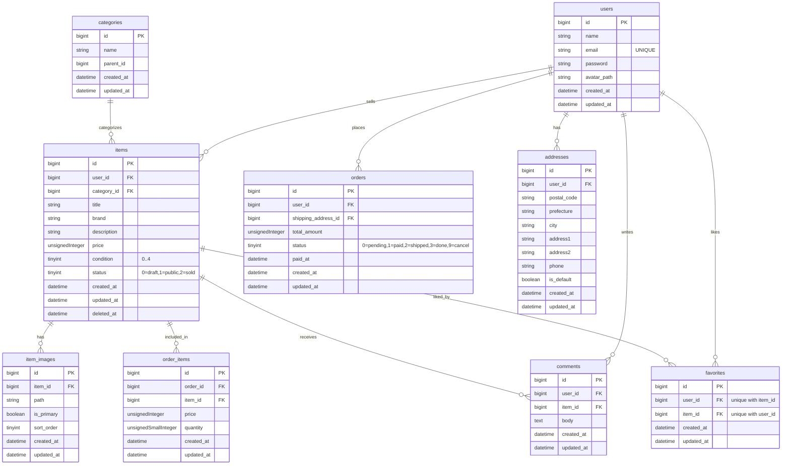

# ER 図

<!-- リレーション（行の意味）

users ||--o{ items : sells … ユーザーは複数の商品を出品できる（1対多）

users ||--o{ orders : places … ユーザーは複数の注文を行う（1対多）

users ||--o{ addresses : has … ユーザーは複数の住所を持てる（1対多）

users ||--o{ comments : writes … ユーザーは複数のコメントを書く（1対多）

items ||--o{ item_images : has … 商品は複数の画像を持てる（1対多）

items ||--o{ order_items : included_in … 商品は複数の注文明細に含まれ得る（1対多）

items ||--o{ comments : receives … 商品には複数コメントが付く（1対多）

users ||--o{ favorites : likes … ユーザーは複数の商品をお気に入り登録できる（1対多：中間表）

items ||--o{ favorites : liked_by … 商品は複数ユーザーにお気に入りされ得る（1対多：中間表）

categories ||--o{ items : categorizes … カテゴリは複数の商品を含む（1対多）

テーブル・カラムの意味
users

id … ユーザーID（主キー）

name … 表示名

email … メールアドレス（ログイン用、重複不可）

password … パスワードハッシュ

avatar_path … プロフィール画像の保存パス（storage/app/public/...）

created_at / updated_at … 作成・更新日時

items

id … 商品ID（主キー）

user_id … 出品者のユーザーID（外部キー）

category_id … カテゴリID（外部キー、任意）

title … 商品名

brand … ブランド名（任意）

description … 商品説明（任意）

price … 価格（円・整数・税込）

condition … 商品状態（0〜4の段階）

status … 公開状態（0=下書き/1=公開/2=売却済み）

created_at / updated_at … 作成・更新日時

deleted_at … 論理削除日時（ソフトデリート）

item_images

id … 画像ID（主キー）

item_id … 商品ID（外部キー）

path … 画像の保存パス（public/items/...）

is_primary … サムネイルかどうか

sort_order … 並び順

created_at / updated_at … 作成・更新日時

categories

id … カテゴリID（主キー）

name … カテゴリ名

parent_id … 親カテゴリID（任意。階層化用）

created_at / updated_at … 作成・更新日時

favorites

id … お気に入りID（主キー）

user_id … ユーザーID（外部キー、item_idと組で一意）

item_id … 商品ID（外部キー、user_idと組で一意）

created_at / updated_at … 作成・更新日時
※「あるユーザーが同じ商品を二重でお気に入りできない」ための組み合わせ一意。

comments

id … コメントID（主キー）

user_id … 投稿者ユーザーID（外部キー）

item_id … 対象商品ID（外部キー）

body … 本文

created_at / updated_at … 作成・更新日時

orders

id … 注文ID（主キー）

user_id … 購入者ユーザーID（外部キー）

shipping_address_id … 送付先住所ID（外部キー、既定住所想定）

total_amount … 合計金額（円・整数）

status … 注文状態（0=保留/1=支払い済み/2=発送済み/3=完了/9=キャンセル）

paid_at … 支払い完了日時（任意）

created_at / updated_at … 作成・更新日時

order_items

id … 注文明細ID（主キー）

order_id … 注文ID（外部キー）

item_id … 商品ID（外部キー）

price … 購入時の単価（スナップショット）

quantity … 購入数量

created_at / updated_at … 作成・更新日時

addresses

id … 住所ID（主キー）

user_id … 所有ユーザーID（外部キー）

postal_code … 郵便番号

prefecture … 都道府県

city … 市区町村

address1 … 番地

address2 … 建物名・部屋番号など（任意）

phone … 電話番号（任意）

is_default … 既定住所かどうか

created_at / updated_at … 作成・更新日時

型表（読み方の目安）

bigint … 大きめ整数（IDなど）

unsignedInteger … 0以上の整数（金額など）

tinyint … 小さな整数（状態フラグや区分に使う）

boolean … 真偽値（true/false）

string … 短めの文字列（可変長）

text … 長文

datetime … 日時（タイムゾーン付き） -->